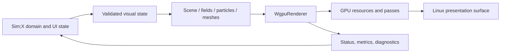

# Sim;Engine Architecture Reference

This document describes the current implementation model, invariants, and
extension boundaries of Sim;Engine. It answers how the engine works and why its
public API is shaped this way. For task-oriented usage, see the
[Integration Guide](INTEGRATION_GUIDE.md).

## 1. Architectural Role

Sim;Engine is the visual layer of Sim;X and a reusable rendering library. Sim;X
is the primary product consumer and design driver. The engine is not a domain
engine: it does not own physics, chemistry, biology, mathematical meaning,
fundamental constants, simulation stepping, navigation, or Lua behavior.

The boundary is visual state:



The host decides what a particle, scalar, cube, or section means. The engine
decides how ready visual data is transformed, clipped, uploaded, composed,
drawn, measured, and recovered.

## 2. Crate And Module Layout

| Module | Responsibility |
| --- | --- |
| `math.rs` | compact 2D vector and rectangle operations |
| `color.rs` | linear color representation, sRGB byte conversion, palette |
| `easing.rs` | normalized easing curves |
| `tween.rs` | fallible time-based visual interpolation |
| `camera.rs` | 2D camera, pseudo-depth, viewport and screen-space markers |
| `scene.rs` | validated ordered 2D command stream and styles |
| `field.rs` | CPU scalar-grid and color-map contracts |
| `pseudo3d.rs` | validated 3D math, transforms, and CPU camera projection |
| `renderer/mod.rs` | public GPU resources, renderer lifecycle, frame paths |
| `renderer/config.rs` | present configuration, DPI conversion, recovery |
| `renderer/tessellation.rs` | Scene primitive to GPU triangle conversion |
| `renderer/visualization.rs` | fused scalar/particle/target composition |
| `renderer/primitive.wgsl` | 2D, particle, heatmap, and composition shaders |
| `renderer/tests.rs` | CPU contracts and semantic GPU readback fixtures |

The `wgpu` feature gates the entire renderer module. Core visual-state types
remain usable and testable without a GPU dependency.

## 3. Coordinate Model

Sim;Engine uses explicit boundaries instead of treating every pair of numbers
as interchangeable pixels.

### 3.1 2D spaces

- World space uses `Vec2` and caller-defined units.
- Logical screen space uses a top-left origin and logical pixels.
- Physical screen space uses surface pixels from the window system.
- Physical texture space defines `RenderTarget2d` dimensions.
- NDC is internal to renderer uniforms and shaders.

Camera zoom converts world units to logical pixels. Display scale converts
logical pixels to physical surface pixels. A stroke has a logical-pixel width;
its apparent width therefore does not scale with world zoom or monitor DPI.

The complete transform is conceptually:

```text
world + pseudo-depth
  -> camera-relative projection
  -> logical screen pixels
  -> physical screen/scissor pixels where required
  -> normalized device coordinates
```

The actual vertex shader receives compact rows that directly map relative world
X/Y and scalar depth to logical screen X/Y. Geometry extents are checked on CPU
against the same arithmetic envelope before upload.

### 3.2 Pseudo-depth

`Projection2d` tilts camera-relative Y and adds a scalar depth offset. Scene
commands capture depth, but ordering remains layer plus insertion. This avoids
an implicit coupling where changing the sign of a projection scale reverses
alpha overlap.

Pseudo-depth is a presentation coordinate, not a z-buffer. It cannot classify
hidden cube edges or occlude independently rotated solids.

### 3.3 3D spaces

The pseudo-3D foundation introduces explicit model, world, view, clip, and
logical-screen stages:

```text
Vec3 model point
  -> Transform3d
  -> Camera3d view basis
  -> Projection3d perspective/orthographic mapping
  -> ProjectedPoint3d
```

It is right-handed with positive Y up. The camera looks along local negative Z;
internally projected view depth is stored as positive distance along its
forward vector. Large finite vector math uses f64 intermediates before checked
f32 output.

Only this CPU foundation exists today. The retained `Mesh3d`, depth attachment,
edge passes, and stereometry composition defined in `PSEUDO_3D.md` are pending.

## 4. Color And Alpha Contract

Public `Color` values are straight linear RGBA.

- `rgb8`/`rgba8` decode sRGB byte channels to linear light.
- `rgb`/`rgba` accept values already in linear space.
- Scene vertex colors remain linear through tessellation.
- Surface formats perform their configured output conversion.
- Offscreen target alpha storage is premultiplied.
- Composition shaders and blend states preserve that premultiplied contract.

`Color::clamp` is an explicit sanitizing operation. Required scene state is
validated before insertion; the renderer does not silently reinterpret an
invalid background as another color.

GPU color maps are 256-entry RGBA8 lookup textures. This is intentionally a
quantized rendering contract, while CPU `ColorMap::sample` remains
piecewise-linear over arbitrary normalized stop positions.

## 5. Scene Representation

`Scene` owns:

- a validated background;
- an ordered `Vec<SceneCommand>`;
- current temporary clip and pseudo-depth state;
- a monotonically increasing insertion order.

`SceneCommand` captures layer, insertion order, pseudo-depth, optional logical
clip, and one immutable `DrawCommand`. Fields of accepted primitives and styles
are private so validation cannot be bypassed through struct literals.

Insertion validates finiteness, drawability, style, derived geometry bounds,
and gradient arithmetic before command ordering. Fallible `try_*` methods
preserve rejection reasons. Convenience methods collapse those reasons to
`bool` only by explicit caller choice.

Sorting is stable by layer. Commands on one layer remain in insertion order,
regardless of pseudo-depth.

## 6. Tessellation And 2D Shader Contract

The general Scene path is CPU tessellated into triangle-list vertices:

- circles become triangle fans;
- rectangles become fans or rounded sectors;
- lines become screen-extruded strips plus round caps;
- polylines share joins and emit only two end caps;
- fills sample solid or gradient color at generated vertices;
- shadows generate separate offset geometry.

Each vertex carries world position, pseudo-depth, linear color, and a logical
screen extrusion direction. The shader applies camera projection and converts
extrusion to screen width. This keeps line width stable under zoom.

`TessellationStats` records submitted, rendered, and dropped commands. A frame
can present while reporting dropped optional geometry; hosts should expose this
when visual completeness matters.

CPU tests duplicate selected shader equations only as narrow arithmetic guards.
Semantic GPU readback executes the actual WGSL and verifies camera/depth/clip,
bilinear sampling orientation, sRGB behavior, half-alpha composition, and
second-device resource restoration.

## 7. Renderer Lifecycle

`WgpuRenderer` owns one presentation surface and its active graphics state:

- `wgpu::Instance`, adapter, device, queue, and surface configuration;
- 2D, dynamic, particle, heatmap, and composition pipelines;
- camera and heatmap uniform buffers;
- transient Scene vertex storage;
- optional MSAA color target;
- cached color-map texture;
- retired devices retained for safe Linux driver teardown.

Creation is async because adapter/device requests are async. The renderer asks
for a high-performance adapter compatible with the supplied surface, requests
portable default limits/features, configures presentation, chooses a supported
MSAA count, and builds pipelines.

Surface dimensions are physical pixels. The renderer stores a validated f64
display scale and derives a finite f32 logical viewport. Scale factors too small
to keep every possible u32 surface finite are rejected before rendering.

## 8. Frame Paths

### 8.1 Streaming Scene

`render_with_metrics` clears reusable CPU vectors, tessellates every command,
validates combined camera/geometry arithmetic, grows the transient GPU buffer
when required, uploads vertices, acquires the surface, encodes batches/scissors,
submits, and presents.

This is the simplest path but performs CPU tessellation and upload every frame.

### 8.2 Prepared Scene

`prepare_scene` tessellates once into an immutable dedicated buffer. A retained
CPU vertex snapshot supports device migration. Rendering reuses GPU geometry and
updates only camera state.

Prepared resources carry an `Arc` renderer identity. Pointer identity prevents
using a buffer with a foreign device before it reaches wgpu validation.

### 8.3 Dynamic Mesh

`DynamicMesh2d` retains a CPU copy and capacity-managed GPU triangle buffer.
Full updates grow to an amortized capacity; aligned range updates reuse the
buffer. Geometry extents are recomputed so unsafe camera/shader combinations are
rejected.

### 8.4 Particles

`ParticleField2d` retains all validated instances on CPU but defers the visible
GPU upload until rendering. The camera culler tests circle/viewport
intersection, applies a uniform candidate sample when visibility checks are
budgeted, compacts the selected list, and writes it once before one instanced
draw.

This makes GPU memory and upload proportional to the render budget rather than
the host's retained population.

### 8.5 Scalar Fields

`ScalarFieldTexture` owns an `R32Float` texture plus retained CPU grid. Full and
rectangular updates validate state before queue writes. Heatmap shaders map a
validated finite value range through the cached color-map LUT using nearest or
manual bilinear scalar sampling.

## 9. Composition Model

`RenderTarget2d` is a renderer-owned physical-pixel texture. Rendering and
composition validate ownership before encoding.

Blend modes are explicit:

- `Alpha` performs normal premultiplied alpha-over;
- `Additive` accumulates light/energy-style overlays;
- `Replace` overwrites destination contribution.

`TrailBuffer2d` uses two targets. History is read from the front target and
written into the back target, then the fresh source is composed and the handles
are swapped. Source/destination aliasing is rejected, preventing undefined GPU
feedback.

The fused layered visualization path creates one encoder for:

1. scalar heatmap to target;
2. camera-culled particle overlay to the same target;
3. target composition to the surface.

One queue submission reduces CPU overhead and synchronization pressure for the
star-remnant workload.

## 10. Resource Ownership And Recovery

Every external GPU resource stores the renderer identity that created it.
Operations check identity before accessing buffers or textures. This turns a
cross-device misuse into a structured error.

Resources fall into two recovery classes:

1. CPU-retained content: prepared scenes, dynamic meshes, particles, and scalar
   textures can recreate exact content on a replacement renderer.
2. GPU-only content: render targets and trail history restore as empty textures
   and must be redrawn.

`recover_device_and_surface` waits for outstanding work, requests a replacement
adapter/device, rebuilds all renderer-owned transient state, reconfigures the
existing surface, and changes identity. Old external resources are rejected
until passed through their matching restore method.

Previous healthy logical devices remain stored until renderer destruction. A
tested NVIDIA/Linux driver path crashed when the old device was dropped
immediately after swapchain migration. Recovery is exceptional, so this bounded
retention is preferred to a native crash.

## 11. Validation Philosophy

The nearest public boundary rejects invalid state:

- NaN and infinity;
- non-positive dimensions, zoom, radius, or scale where prohibited;
- derived f32 overflow, not only non-finite source fields;
- invalid gradient/range subtraction;
- texture and buffer allocations beyond active device limits;
- renderer/resource identity mismatch;
- update regions outside retained state;
- composition aliasing and invalid opacity.

Mutating fallible methods are atomic: validation occurs before retained state or
GPU handles are replaced. Error enums encode the rejected contract instead of
logging and continuing.

Where late tessellation can still drop a command, the count is observable.

## 12. Memory And Capacity Model

Capacity-bearing resources expose their relevant allocation:

- prepared and dynamic resources expose CPU recovery bytes;
- particle fields expose CPU allocation, GPU allocation, and snapshot bytes;
- scalar textures expose retained and GPU bytes;
- targets and trails expose format-aware physical texture bytes.

Before allocation, counts are checked with integer arithmetic and compared with
the active device's buffer/texture limits. Capacity errors are returned before
invalid wgpu resources are created.

`ParticleRenderBudget` independently limits visible count, GPU instance bytes,
upload bytes per frame, and visibility checks. This is the main mechanism for
leaving CPU/GPU capacity to Sim;X domain simulation.

## 13. Timing And Performance Semantics

`RendererFrameMetrics` measures CPU wall time around stages:

- tessellation/validation;
- upload calls;
- camera uniform upload;
- surface acquisition;
- encode, submit, and present dispatch;
- total renderer call.

These values do not measure GPU completion. Under FIFO, queue back-pressure
usually appears in surface acquisition. A monitor refresh cap is therefore not
renderer throughput.

Reliable performance evidence records:

- release profile;
- VSync/present mode;
- adapter, backend, and driver;
- workload size and budgets;
- warm-up and sample duration;
- frame interval separately from renderer CPU;
- GPU timing only when timestamp-query instrumentation exists.

The current renderer has no public GPU timestamp report.

## 14. Threading And Async Model

The API is designed for ownership by the host's render/event-loop thread.
Renderer initialization and recovery are async; ordinary resource updates and
render calls are synchronous submission methods.

The engine does not spawn a simulation scheduler or background render thread.
Sim;X can step simulation on its chosen workers, then transfer a ready bounded
visual snapshot to the render thread. This prevents the renderer from owning
or serializing domain work.

Asynchronous simulation is beneficial only when its synchronization and
snapshot cost is below the work it overlaps. Making every small Scene mutation
async would add coordination overhead without improving GPU submission.

## 15. Extension Rules

New public paths must satisfy all of the following:

1. A real Sim;X or reusable consumer demonstrates the need.
2. Domain meaning stays in the host; the engine accepts visual state.
3. Coordinate spaces and units are explicit.
4. Constructors and updates validate finite and derived arithmetic.
5. Device limits and memory accounting are observable.
6. Resource ownership and recovery behavior are defined.
7. CPU tests cover boundaries; GPU readback covers shader semantics.
8. Performance claims have a named workload and environment.
9. Public fields do not freeze invalid-state representation.
10. The no-default-features build remains valid for CPU-side APIs.

## 16. Pseudo-3D Direction

Sim;Math is the documented exception to Sim;X's mostly 2D product model.
Stereometry requires independently transformed solids, perspective or
orthographic view, depth, hidden edges, sections, hatching, projected labels,
and picking.

The 3D path will remain focused rather than turning Sim;Engine into a general
AAA renderer. Its intended pipeline is:

1. retained triangle topology and model-instance transforms;
2. depth-only or visible surface pass;
3. solid visible-edge fragments;
4. screen-space dashed occluded-edge fragments;
5. translucent/hatched section pass;
6. projected anchors composed with the 2D overlay.

Back-face adjacency alone is not sufficient: an inner octahedron, section, or
second object may occlude an edge. Hidden-line semantics must be backed by depth
testing and tested by GPU readback.

The detailed contract is in [PSEUDO_3D.md](PSEUDO_3D.md).

## 17. Quality And Release Gates

The Linux release gate runs:

```bash
cargo fmt --all -- --check
cargo test --all-targets --all-features
cargo test --no-default-features
cargo clippy --all-targets --all-features -- -D warnings
cargo test --doc --all-features
RUSTDOCFLAGS="-D warnings" cargo doc --all-features --no-deps
SIM_ENGINE_REQUIRE_GPU_TESTS=1 cargo test --all-features \
  renderer::tests::offscreen_gpu_readback_verifies_camera_depth_and_clip_contract \
  -- --nocapture
git diff --check
cargo package --allow-dirty --offline --list
cargo package --allow-dirty --offline
```

CI runs all targets on Linux and a mandatory Mesa Vulkan semantic GPU fixture.
Hardware performance/recovery claims require a named Linux adapter and driver.

## 18. Known Boundaries

- Linux is the only first-release support target.
- The crate is pre-1.0; documented migrations may still break source API.
- Text shaping and glyph caching are not implemented.
- The pseudo-3D renderer stops at CPU math/camera projection today.
- Renderer metrics are CPU-side; GPU timestamps are not exposed.
- Independent multi-window recovery has not yet been proven.
- GPU-only target/trail contents cannot be reconstructed after device recovery.

These are explicit development boundaries, not silently implied capabilities.
